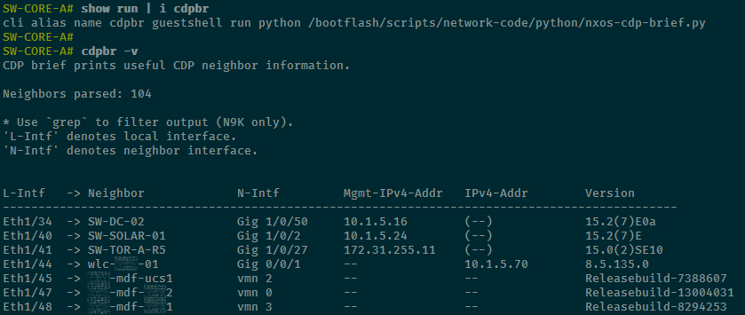

[](https://developer.cisco.com/codeexchange/github/repo/derek-shnosh/nxos-cdp-helpers)

# NX-OS CDP Helpers

## Overview

Python scripts designed to assist network engineers working with NX-OS devices. The primary focus is on enhancing the visibility and manageability of Cisco Discovery Protocol (CDP) information while working with NX-OS CLI; i.e., via console or ssh.

***

## Set up

### With Guestshell (N9K)

1. **Init guestshell**, adjust `resize` commands to your preference.
   ```bash
   # Disable guestshell to resize allocations
   guestshell disable
   y

   # Resize guestshell allocations
   guestshell resize cpu 10
   guestshell resize mem 2048
   guestshell resize rootfs 2000
   guestshell enable
   ```

**NOTE**: Steps 2-5 are to be ran straight from NX-OS CLI. To run within guestshell, enter `guestshell` in NX-OS CLI and then run the commands without "guestshell run".

2. **Set up DNS for guestshell** and test DNS ping.
   ```
   guestshell run sudo sh -c 'echo nameserver 9.9.9.9 > /etc/resolv.conf'
   guestshell run sudo chvrf management ping -c4 google.com
   ```

3. **Update guestshell & add dependencies**, the `yum update` process may take a while.
   ```bash
   guestshell run sudo chvrf management yum -y update
   guestshell run sudo chvrf management yum -y install git
   guestshell run sudo chvrf management pip3 install natsort
   ```

4. **Remove guestshell DNS config** (security measure).
   ```bash
   guestshell run sudo sh -c 'echo "" > /etc/resolv.conf'
   ```

5. **Create CLI aliases** to run the scripts.
   ```bash
   cli alias name cdpbr guestshell run python /bootflash/scripts/nxos-cdp-helpers/nxos-cdp-brief.py
   cli alias name cdpdesc guestshell run python /bootflash/scripts/nxos-cdp-helpers/nxos-cdp-describe.py -i
   ```

### Without Guestshell

1. **Copy the scripts** to the switch.
   ```bash
   copy <source>/nxos-cdp-brief.py bootflash:scripts/
   copy <source>/nxos-cdp-describe.py bootflash:scripts/
   ```

2. **Create CLI aliases** to run the scripts.
   ```bash
   cli alias name cdpbr python /bootflash/scripts/nxos-cdp-brief.py
   cli alias name cdpdesc python /bootflash/scripts/nxos-cdp-describe.py -i
   ```

***

## Script: `nxos-cdp-brief.py`

<center>

</center>

This script generates a custom CDP neighbor _brief_ table that displays the **local interface** for each neighbor, along with the **neighbor hostname**, **connecting interface**, **IP address** (mgmt preferred), and optionally their **platform** and **software version**.

### Features
- **Multiple Neighbors Handling**: The script accounts for interfaces with multiple CDP neighbors. This is particularly useful in situations where a downstream switch may pass CDP information from subsequent switches, or for Hypervisor _vSwitches_ passing CDP information for guest VMs.
- **Natural Sorting**: Uses the `natsort` module to sort neighbors by interface in a human-readable order. If `natsort` is not installed, a lexicographical sort is performed (see the [`natsort` PyPI page](https://pypi.org/project/natsort/) for elaboration).
- **Optional Information**: Display additional platform and version information using `-p` and `-v` arguments.

### Output Fields
- **L-Intf**: Local interface where the neighbor was discovered.
- **Neighbor**: Neighbor's hostname.
- **N-Intf**: Neighbor's interface connected to the local interface.
- **Mgmt-IPv4-Addr**: Management IPv4 address of the neighbor.
- **IPv4-Addr**: Neighbor's highest valued IP address, only shown if different from the management IP.
- **Platform (`-p`)**: Neighbor's platform or model (optional).
- **Version (`-v`)**: Neighbor's software/firmware version (optional).

### Example Usage

```bash
# CDP brief output
cdpbr
```

## Script: `nxos-cdp-describe.py`

This script will rename interfaces based on the CDP information present, formatted as `HOSTNAME:INTF`. For example, if NX-OS interface **Eth1/3** has a neighbor entry for **IDF-1-ACCESS** that is uplinkd using its **Te1/1/1** interface, the description would be `IDF-1-ACCESS:1/1/1`

### Features
- **Single interface description**: Run the script against a single interface to rename only that interface, no prompt provided.
- **Interface descriptions for all interfaces with CDP neighbors**: Run the script against all interfaces and it will parse neighbors and prompt to update descriptions accordingly.

### Example Usage

```bash
# CDP describe, single interface
cpdesc Eth1/3

# CDP describe, all interfaces
cdpdesc all
```

---

## Requirements

- Python 2.x/3.x
- NX-OS device with the capability to run Python scripts

## License

This project is licensed under the MIT License - see the [LICENSE](LICENSE) file for details.
